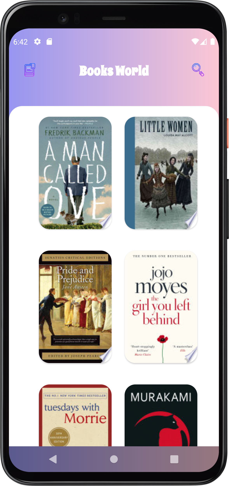
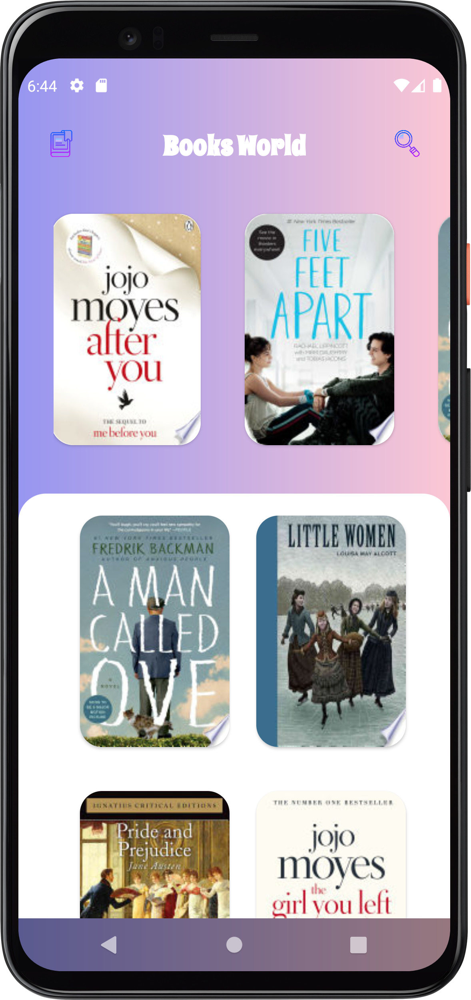
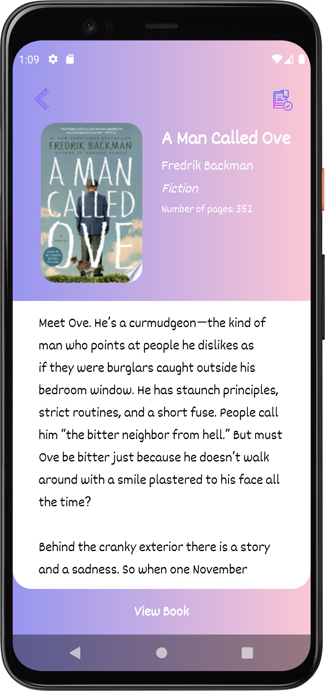

# BooksWorld

An android app that get books from [BooksWorld-API](https://github.com/FtADev/BooksWorld-API) and show their information and could persist each one on local database to read them offline

## Third Party Libraries

* **Networking:** Retrofit
* **Multi Threading:** Coroutines
* **Image Loading:** Picasso, Glide (Use both for comparing them!)
* **Database:** RoomDB

## Architecture
 
**MVVM Architecture**

### **Architecture Component:**

* **Live Data**
* **View Model**
* **Navigation**
* **Paging**
## Screenshots

